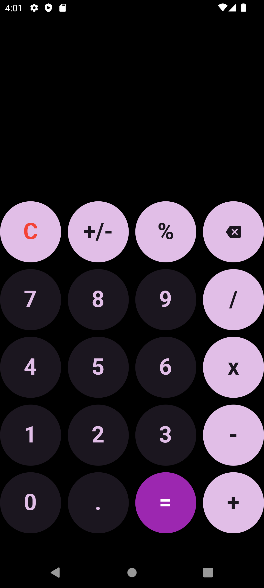

# Calculadora Flutter

Proyecto hecho para clase

Hace las operaciones en tiempo real al mismo tiempo que se escriben, posiblemente tiene muchos bugs ya que alguno de los algoritmos no son lo más optimizado que existe pero no debería crashear fatalmente en principio.

